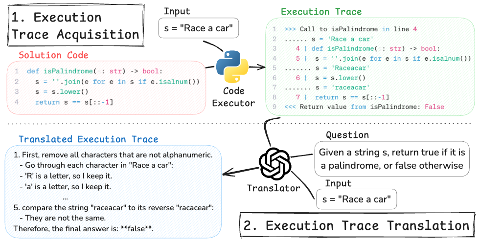

# Code Execution as Grounded Supervision for LLM Reasoning

This is the official repository for [Code Execution as Grounded Supervision for LLM Reasoning]()

## Introduction

We propose a scalable method for **generating verifiable CoT data to supervise the reasoning process of LLM by leveraging the determinism of program execution**. Unlike existing reasoning dataset generation methods that rely on costly human annotations or error-prone LLM-generated CoT, our approach **extracts verifiable, step-by-step reasoning traces from code execution** and **transforms them into a natural language CoT reasoning**, producing highly accurate reasoning traces. Models trained on our generated data demonstrate superior reasoning abilities across various domains, while generating fewer tokens during inference, effectively reducing overthinking and meaningless repetition.

<p align="center">
    
<p>

## Released Resources 

### Dataset

You can download our dataset from [huggingface](https://huggingface.co/datasets/dongwonj/Execution-Grounded-Reasoning)

### Models

|Base Model|Link|
|-|-|
|Qwen3-4B|[🤗](https://huggingface.co/dongwonj/Qwen3-4B_code_execution_trace)|
|Qwen3-8B|[🤗](https://huggingface.co/dongwonj/Qwen3-8B_code_execution_trace)|

## Installation
```bash
python -m venv venv
source venv/bin/activate
pip install -r requirements.txt
```

## Data Generation 🔧
For our experiment, we used [Pyedu](https://huggingface.co/datasets/hkust-nlp/CodeIO-PyEdu-Reasoning-Raw) dataset released by [CodeI/O](https://huggingface.co/papers/2502.07316). If you want to reproduce our data generation, download the Pyedu dataset and place it under `data/`. For a quick start, we provide a small subset of the data under `data/`.

### Data Generation Pipeline
Execute the following Python scripts to generate an execution trace for each coding problem and filter out unsuccessful executions. We employ a Python debugging tool called [Snoop](https://github.com/alexmojaki/snoop) to record detailed line-by-line execution signals, which will serve as a basis for grounded supervision for enhanced reasoning.
```bash
python src/filter_raw_data.py
python src/generate_execution_trace.py
python src/filter_execution_trace.py
```
Then, use a Translator model to translate the execution traces to a more natural form of reasoning. The `nl_trace` field in the resulting file will contain the translated execution trace. 
```bash
python src/execution_trace_translation.py --translator_model Qwen/Qwen3-32B --num_gpus 8
```
Run the following script to convert the final data into training data compatible with [LLaMA-Factory](https://github.com/hiyouga/LLaMA-Factory).
```bash
python src/data_construction.py --trained_model Qwen/Qwen3-4B
```

## Acknowledgments 🏆
Our work builds upon and is inspired by the following projects. We sincerely appreciate their contributions to the community:

- [Snoop](https://github.com/alexmojaki/snoop)
- [CodeIO](https://github.com/hkust-nlp/CodeIO)
- [LLaMA Factory](https://github.com/hiyouga/LLaMA-Factory)

## Citation
```bibtex
@article{jung2025code,
  title={Code Execution as Grounded Supervision for LLM Reasoning},
  author={Jung, Dongwon and Zhou, Wenxuan and Chen, Muhao},
  journal={arXiv preprint arXiv:2506.10343},
  year={2025}
}
